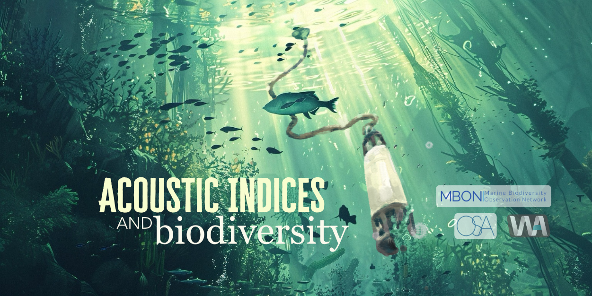

# Underwater acoustic indices and ocean biodiversity

This project was done in collaboration with 
[Ocean Science Analytics](https://www.oceanscienceanalytics.com/). For more 
information, please check 
[this post](https://waveformanalytics.com/soundscapes/) on Waveform Analytics' 
website. 

## Summary of code

This repository contains the code used to prepare the data and to build the 
dashboard. The data preparation was done using Python, and the dashboard 
was build using R Shiny. 

## Additional links

[Interactive data dashboard](https://ocean-science-analytics.shinyapps.io/biosound-mbon/)

[Documentation site](https://ocean-science-analytics.github.io/biosound-exploratory-project/overview.html)
